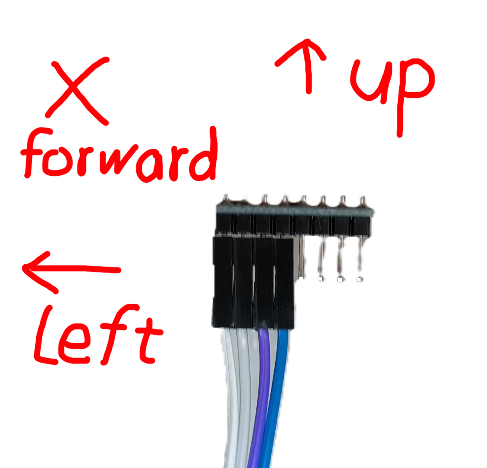

# VR Maze

## Usage

`python main.py [-h] [--secret] [-v] [-s SERIAL] [-b BAUDRATE] [-c] [-i] [--ipd IPD] [--concentrate CONCENTRATE] [--speed SPEED] [--size SIZE] [--collidedistance COLLIDEDISTANCE] [--maxbrightness MAXBRIGHTNESS] [--fovy FOVY]`

- `-v`: Enable the VR mode
- `--ipd`: The IPD of the player
- `--concentrate`: The IPD ratio after 1 block
- `--speed`: The speed of the player
- `--size`: The size of the maze
- `--collidedistance`: The minimum distance between the player and the wall
- `--maxbrightness`: The maximum brightness level of the screen
- `--fovy`: The field of view
- `-h`: show this help message and exit
- `--secret`:show the full help message including the private parameters, you should never use these parameters
- `-s`: The port of the serial. You can use a single string or a tuple of strings to set the port, you can also use `auto` or `(auto,auto)`(any times) to let the program await the port to be connected
- `-b`: The baudrate of the serial, be single int or tuple of int

## Environment

use python 3.7

- `-c`: Check the runtime environment
- `-i`: Install the required packages

## Hardware

### Standard Scheme

#### 1. Arduino Uno + Rocker

- Change the defination of VAX, VAY, SW pin in `./game/arduino/uno/uno.ino`. Now they're A1, A2, A3

#### 2. Arduino Micro + MPU6050

- Merely use the code in `./game/arduino/micro/micro.ino`, the orientation of mpu should be the same as the following image
  
- the `SDA` pin should be connected to `pin2`, the `SCL` pin should be connected to `pin3`

### Other Scheme

You should use the structure `Start;<message>;End;` to send message through serials, and the message should be `Rocker: <VAX>, <VAY>, <SW>` and `MPU: <quat[0]>, <quat[1]>, <quat[2]>, <quat[3]>`, where `quat` is the quaternion representing the gesture of the mpu

## Copy

Files in `./game/arduino/micro` are copied and modified from <https://github.com/relativty/Relativty.git>

## LICENSE

[GPL-3.0 LICENCE](LICENSE.txt)
